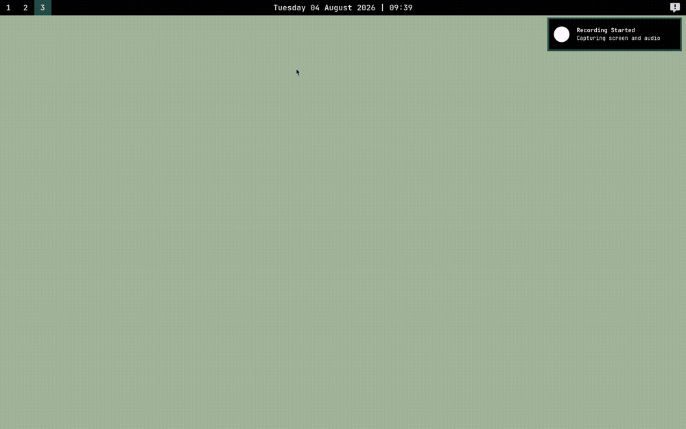

# notse

notse is a terminal-based notes app. It runs as a TUI inside your terminal and
stores notes in a local JSON file.

<p align="center">
  
</p>

## Setup

### Requirements

- Go >= 1.24

### Pre-built

Download the latest binary from the [releases
page](https://github.com/RahulSandhu/notse/releases).

### Build from source

```sh
git clone https://github.com/RahulSandhu/notse.git
cd notse
make install
```

## Usage

Run `notse` from your terminal:

```sh
notse
```

Notes are saved to `~/.config/notse/notes_history.json`.

A `theme.json` file in the same directory lets you customize colors (see the
`internal/config/config.go` `Theme` struct for available fields).

### Keybindings

<div align="center">

| Key            | Action                  |
| -------------- | ----------------------- |
| `j/k` or `↑/↓` | Navigate within page    |
| `h/l` or `←/→` | Change page             |
| `enter`        | View note               |
| `n`            | New note                |
| `e`            | Edit note               |
| `s`            | Cycle status (view)     |
| `backspace`    | Delete note             |
| `p`            | Pin/unpin               |
| `?`            | Toggle keybindings help |
| `tab`          | Switch field (edit)     |
| `ctrl+s`       | Save (edit)             |
| `esc`          | Back / quit             |
| `q` / `ctrl+c` | Force quit              |

</div>
